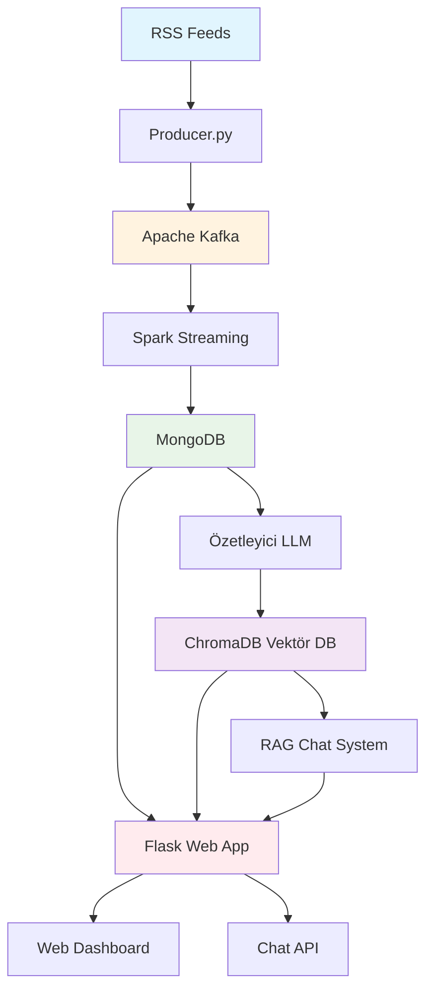
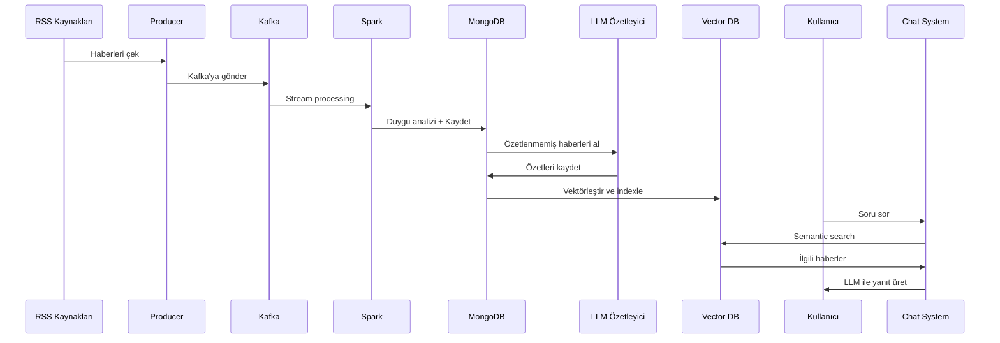

# 🔥 **Haber Analiz ve RAG Sistemi**

> **Gerçek zamanlı haber analizi, duygu tespiti ve akıllı soru-cevap sistemi**


---

## 🎯 **Proje Genel Bakış**

Bu sistem, RSS kaynaklarından haberleri çekerek gerçek zamanlı analiz yapar ve kullanıcıların sorularını akıllı bir şekilde yanıtlayan RAG (Retrieval Augmented Generation) tabanlı bir chatbot sunar.

### ✨ **Temel Özellikler**

- 🔄 **Gerçek Zamanlı Haber Çekme**: RSS kaynaklarından otomatik haber toplama
- 🧠 **Duygu Analizi**: TextBlob ile pozitif/negatif/nötr duygu tespiti  
- 📝 **Otomatik Özetleme**: LLM ile haber özetleri oluşturma
- 🔍 **Vektör Arama**: Semantic search ile alakalı haberleri bulma
- 💬 **Akıllı Chatbot**: RAG sistemi ile doğal dil soru-cevap
- 📊 **Web Dashboard**: Flask tabanlı analiz ve görselleştirme arayüzü

---

## 🏗️ **Sistem Mimarisi**



### 🔄 **Veri Akış Diyagramı**



---

## 🛠️ **Teknoloji Stack'i**

### **Backend**
- **🐍 Python 3.8+**: Ana geliştirme dili
- **⚡ Apache Spark**: Büyük veri işleme ve streaming
- **🔄 Apache Kafka**: Gerçek zamanlı veri akışı
- **🍃 MongoDB**: NoSQL veritabanı
- **🔍 ChromaDB**: Vektör veritabanı

### **Machine Learning & AI**
- **🤖 LangChain**: LLM orkestrasyon framework'ü
- **🧠 Sentence Transformers**: Metin embedding'leri
- **💭 TextBlob**: Duygu analizi
- **🎯 Google Gemma**: LLM model (OpenRouter API)

### **Web Framework**
- **🌐 Flask**: Web framework ve REST API
- **📊 Chart.js**: Veri görselleştirme
- **🎨 Bootstrap**: Frontend UI

---

## 📁 **Proje Yapısı**

```
haber-analiz-sistemi/
├── 🚀 main.py                 # Otomatik sistem başlatıcı
├── 📡 producer.py             # RSS → Kafka producer
├── ⚡ spark_streaming.py      # Kafka → MongoDB consumer
├── 📝 ozetleyici.py          # LLM ile haber özetleme
├── 🔍 index_haberler.py      # MongoDB → ChromaDB indexleme
├── 💬 chat_query.py          # RAG chat test script'i
├── 🌐 app.py                 # Flask web uygulaması
├── 📋 requirements.txt        # Python dependencies
├── 🔧 .env                   # Environment variables
├── 📊 templates/             # HTML template'leri
│   └── index.html
└── 💾 chroma_haber/          # ChromaDB vektör veritabanı
```

---

## ⚙️ **Kurulum ve Çalıştırma**

### 1️⃣ **Sistem Gereksinimleri**

```bash
# Python 3.8+
python --version

# Java 8+ (Spark için)
java -version

# MongoDB
mongod --version

# Apache Kafka
kafka-server-start --version
```

### 2️⃣ **Repository Clone & Dependencies**

```bash
git clone https://github.com/username/haber-analiz-sistemi.git
cd haber-analiz-sistemi

# Virtual environment oluştur
python -m venv venv
source venv/bin/activate  # Linux/Mac
# venv\Scripts\activate   # Windows

# Dependencies yükle
pip install -r requirements.txt
```

### 3️⃣ **Environment Configuration**

`.env` dosyası oluşturun:

```env
# OpenRouter API Key (LLM için)
OPENROUTER_API_KEY=your_openrouter_api_key_here

# MongoDB Connection
MONGODB_URI=mongodb://localhost:27018/

# Kafka Configuration  
KAFKA_BOOTSTRAP_SERVERS=localhost:9292
KAFKA_TOPIC=haber-akisi

# Optional: Other configurations
LOG_LEVEL=INFO
```

### 4️⃣ **Servis Başlatma**

```bash
# MongoDB başlat (port 27018)
mongod --port 27018

# Kafka başlat (port 9292) 
kafka-server-start.sh config/server.properties

# Kafka topic oluştur
kafka-topics.sh --create --topic haber-akisi --bootstrap-server localhost:9292
```

### 5️⃣ **Uygulama Çalıştırma**

```bash
# 🚀 TEK KOMUTLA TÜM SİSTEMİ BAŞLAT
python main.py

# Sistem otomatik olarak sırasıyla başlatır:
# 1️⃣ RSS Producer (arka planda)
# 2️⃣ Spark Streaming (arka planda) 
# 3️⃣ Haber Özetleyici (arka planda)
# 4️⃣ Haber İndexleyici (tek seferlik)
# 5️⃣ Flask Web App (arka planda)

# Durdurmak için: Ctrl+C
```

**🎯 Otomatik Başlatma Süreci:**
- ✅ Dosya varlık kontrolü
- 🔄 Servisler arası 15 saniye bekleme
- 📊 Sürekli sistem izleme
- 🛡️ Güvenli kapatma (SIGINT/SIGTERM)

---

## 🎮 **Kullanım Kılavuzu**

### 🚀 **Otomatik Sistem Başlatma**

```
╔══════════════════════════════════════╗
║          HABER ANALİZ SİSTEMİ        ║
║              v1.0.0                  ║
╚══════════════════════════════════════╝

[2024-01-20 15:30:00] 🎯 Haber Analiz Sistemi Başlatılıyor
============================================================
[2024-01-20 15:30:01] 1️⃣ RSS Producer başlatılıyor...
[2024-01-20 15:30:02] ✅ producer.py arka planda başlatıldı (PID: 1234)
[2024-01-20 15:30:17] 2️⃣ Spark Streaming başlatılıyor...
[2024-01-20 15:30:18] ✅ spark_streaming.py arka planda başlatıldı (PID: 1235)
[2024-01-20 15:30:33] 3️⃣ Haber Özetleyici başlatılıyor...
[2024-01-20 15:30:34] ✅ ozetleyici.py arka planda başlatıldı (PID: 1236)
[2024-01-20 15:30:49] 4️⃣ Haber İndexleyici çalıştırılıyor...
[2024-01-20 15:30:52] ✅ index_haberler.py başarıyla tamamlandı
[2024-01-20 15:31:07] 5️⃣ Flask Web Uygulaması başlatılıyor...
[2024-01-20 15:31:08] ✅ app.py arka planda başlatıldı (PID: 1237)
[2024-01-20 15:31:08] 🎉 Tüm servisler başarıyla başlatıldı!
[2024-01-20 15:31:08] 🌐 Web uygulaması: http://localhost:5000
============================================================
[2024-01-20 15:31:08] 💡 Sistem durdurmak için Ctrl+C tuşlayın
```

### 🌐 **Web Dashboard**

Web arayüzüne erişim: `http://localhost:5000`

**Dashboard Özellikleri:**
- 📊 Gerçek zamanlı haber istatistikleri
- 🎭 Duygu analizi grafikleri  
- 🔥 Popüler konular word cloud
- 💬 Akıllı chatbot arayüzü

### 💬 **Chat Sistemi Örnekleri**

```
Kullanıcı: "Son ekonomi haberleri neler?"
🤖 Bot: Son 24 saatte 15 ekonomi haberi analiz edildi. 
        Başlıca konular: enflasyon oranları, döviz kurları...

Kullanıcı: "Haberlerin genel havası nasıl?" 
🤖 Bot: Son haberlerin %45'i pozitif, %30'u nötr, %25'i negatif 
        duygu içeriyor. Genel trend iyimser görünüyor.
```

---

## 📊 **API Endpoints**

| Endpoint | Method | Açıklama |
|----------|---------|-----------|
| `/` | GET | Ana dashboard |
| `/api/ozetler` | GET | Son 50 haber özeti |
| `/api/duygular` | GET | Duygu analizi verileri |
| `/api/populer_konular` | GET | En popüler kelimeler |
| `/api/stats` | GET | Genel istatistikler |
| `/api/chat` | POST | Chat bot API |

### Chat API Örneği:

```bash
curl -X POST http://localhost:5000/api/chat \
  -H "Content-Type: application/json" \
  -d '{"message": "Son teknoloji haberleri neler?"}'
```

---

## 🔧 **Konfigürasyon**

### **RSS Kaynakları** (producer.py)
```python
RSS_FEEDS = [
    "https://www.cnnturk.com/feed/rss/news",
    "https://www.bbc.com/news/10628494", 
    "https://www.aa.com.tr/tr/rss/default?cat=guncel"
]
```

### **LLM Model Ayarları** (ozetleyici.py)
```python
model = ChatOpenAI(
    model="google/gemma-3-27b-it:free",
    temperature=0.4,
    max_tokens=300
)
```

---

## 🐛 **Sorun Giderme**

### **Yaygın Hatalar ve Çözümleri**

#### ❌ MongoDB Connection Error
```bash
# Çözüm: MongoDB servisini başlat
mongod --port 27018
```

#### ❌ Kafka Connection Refused  
```bash
# Çözüm: Kafka servisini kontrol et
kafka-server-start.sh config/server.properties
```

#### ❌ OpenRouter API Key Error
```bash
# Çözüm: .env dosyasında API key'i kontrol et
OPENROUTER_API_KEY=your_valid_key_here
```

#### ❌ Script Dosyası Bulunamadı
```bash
# Çözüm: Tüm Python dosyalarının mevcut olduğundan emin olun
[2024-01-20 15:30:00] ⚠️  producer.py dosyası bulunamadı!
[2024-01-20 15:30:00] ❌ Sistem başlatılamıyor, eksik dosyalar var!
```

#### ❌ Process Timeout
```bash
# Çözüm: Script'lerin 5 dakika içinde tamamlanmasını sağlayın
[2024-01-20 15:35:00] ⏰ index_haberler.py timeout'a uğradı
```

---

## 📈 **Performans Metrikleri**

- ⚡ **Veri İşleme**: ~1000 haber/dakika
- 🔍 **Arama Hızı**: <100ms semantic search
- 💭 **LLM Yanıt**: ~2-5 saniye
- 💾 **Vektör DB**: 10K+ embedding kapasitesi
- 🌐 **Web Response**: <200ms ortalama
- 🔄 **Sistem İzleme**: 30 saniye aralıklarla

---

## 🤝 **Katkıda Bulunma**

1. Fork yapın
2. Feature branch oluşturun (`git checkout -b feature/amazing-feature`)
3. Değişiklikleri commit edin (`git commit -m 'Add amazing feature'`)
4. Branch'i push edin (`git push origin feature/amazing-feature`)
5. Pull Request açın

---

## 📝 **Lisans**

Bu proje MIT lisansı altında lisanslanmıştır. Detaylar için [LICENSE](LICENSE) dosyasına bakın.

---

## 👤 **İletişim**

- 📧 Email: cankumet@gmail.com
- 💼 LinkedIn: [linkedin.com/in/fahri-can-kümet](https://www.linkedin.com/in/fahri-can-k%C3%BCmet/)
- 🐙 GitHub: [@cankumet](https://github.com/cankumet)

---

## 🙏 **Teşekkürler**

- [LangChain](https://langchain.com/) - LLM framework
- [ChromaDB](https://www.trychroma.com/) - Vector database
- [Apache Spark](https://spark.apache.org/) - Big data processing
- [OpenRouter](https://openrouter.ai/) - LLM API services

---

<div align="center">
  
**⭐ Projeyi beğendiyseniz yıldız vermeyi unutmayın!**

</div>
